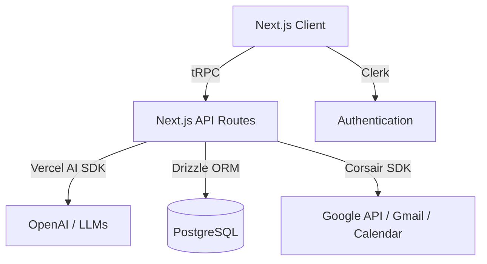

# 🏛️ Neurosync Architecture

Neurosync is built using a modern Next.js stack, heavily inspired by the T3 stack. It is engineered specifically for rapid data synchronization, secure third-party integrations, and real-time AI interactions.

---

## 🗺️ High-Level Overview

---

## 🛠️ Core Technologies

- **Next.js 15+ (App Router)**: The core framework for both frontend React components and backend API routes. Ensures optimized server-side rendering and static generation.
- **tRPC**: Provides end-to-end typesafe APIs between the React frontend and the Node.js backend without the need for manual schema generation or GraphQL.
- **Drizzle ORM**: A lightweight, typesafe Object Relational Mapper for connecting to our PostgreSQL database, offering high performance and edge compatibility.
- **Clerk**: Handles user authentication, session management, identity verification, and onboarding flows seamlessly.
- **Corsair**: An advanced integrations framework that securely manages OAuth 2.0 connections (specifically Gmail and Google Calendar), rotates tokens automatically, and normalizes webhook events into our database.
- **Vercel AI SDK**: Powers the conversational interface, manages chat history state, and streams AI responses back to the client in real-time.

---

## 🔄 Data Flow Deep-Dive

1. **User Authentication (Clerk)** 
   Authentication is handled entirely by Clerk. When a user creates an account, a corresponding "tenant" is created in Corsair for managing their specific API integrations. The user session token is validated on every tRPC request.

2. **Third-Party Integration (OAuth Handshake)**
   When a user connects Gmail or Google Calendar via the `/onboarding` page, they are redirected to Corsair's managed flow. Corsair securely handles the Google OAuth handshake, obtains refresh and access tokens, and stores them encrypted at rest using `CORSAIR_KEK`.

3. **Webhooks & Real-Time Sync** 
   Corsair listens to external Google Cloud Pub/Sub updates (e.g., incoming emails, new calendar events). It automatically processes these webhooks and pushes normalized event data into our PostgreSQL database via our `/api/webhooks` endpoint. This allows the dashboard to reflect new emails instantly.

4. **AI Agent Interaction (Tool Execution)** 
   When a user interacts with the Assistant Panel (e.g., *"Draft an email to John"*), the client invokes a tRPC mutation. The backend processes the prompt using the Vercel AI SDK (`src/server/agent.ts`). The LLM dynamically selects from registered server-side tools to query the Drizzle database or invoke Corsair's proxy. Corsair then executes the requested action directly against the Google APIs on behalf of the authenticated user.
