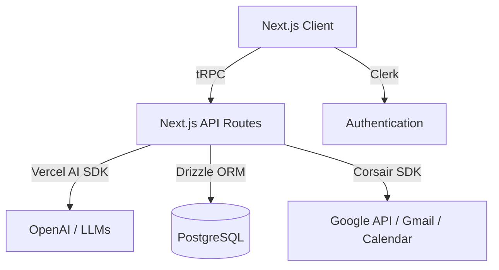

# Neurosync Architecture

Neurosync is built using a modern Next.js stack, heavily inspired by the T3 stack, optimized for AI interactions and rapid data synchronization.

## High-Level Overview

## Core Technologies

- **Next.js (App Router)**: The core framework for both frontend React components and backend API routes.
- **tRPC**: Provides end-to-end typesafe APIs without generating types or schemas manually.
- **Drizzle ORM**: A lightweight, typesafe ORM for connecting to our PostgreSQL database.
- **Clerk**: Handles user authentication, session management, and onboarding flows.
- **Corsair**: An integrations framework that securely manages OAuth 2.0 connections (Gmail, Google Calendar) and normalizes webhook events into our database.
- **Vercel AI SDK**: Powers the chat interface and streams AI responses back to the client.

## Data Flow

1. **User Authentication**: Handled entirely by Clerk. When a user creates an account, a corresponding "tenant" is created in Corsair for managing their integrations.
2. **Third-Party Integration**: When a user connects Gmail or Google Calendar via the `/onboarding` page, they are redirected to Corsair. Corsair securely handles the OAuth handshake and stores the credentials encrypted at rest.
3. **Webhooks & Sync**: Corsair listens to external updates (e.g., incoming emails, new calendar events) and pushes normalized webhook events into our PostgreSQL database via our `/api/webhooks` endpoint.
4. **AI Agent Interaction**: When a user asks the assistant a question (e.g., "What are my emails today?"), the client calls a tRPC mutation. The backend uses the Vercel AI SDK (`src/server/agent.ts`), which dynamically selects server-side tools to query the Drizzle database or invoke Corsair's proxy to interact directly with Google APIs on behalf of the user.
